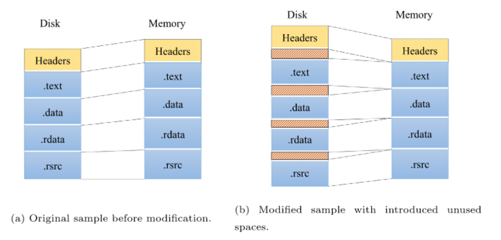
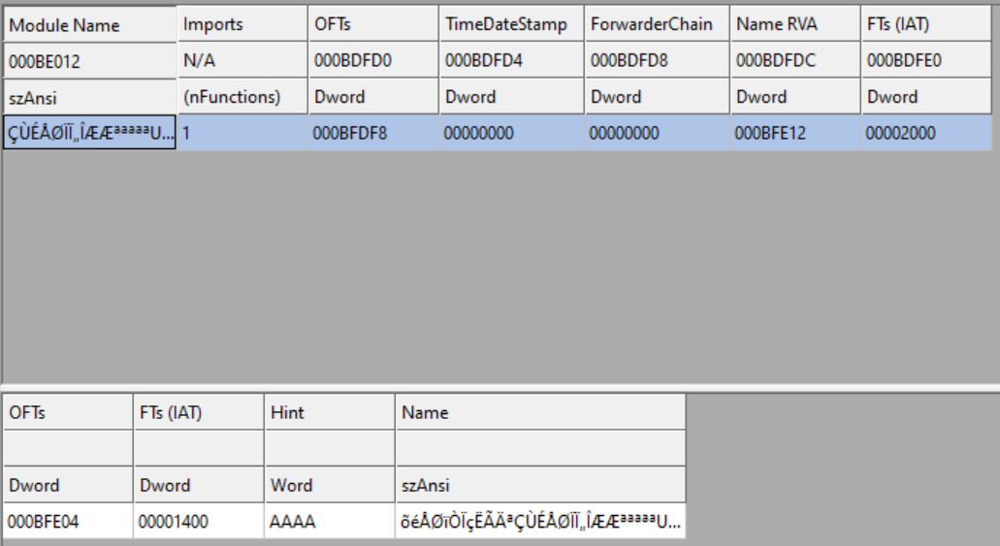
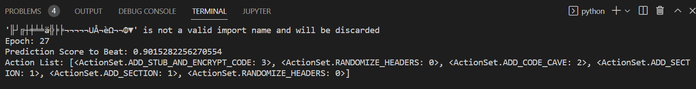
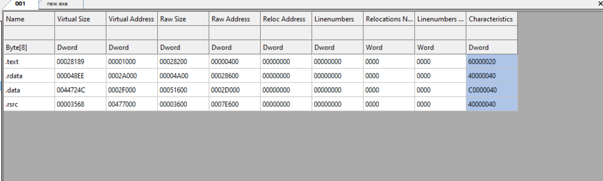
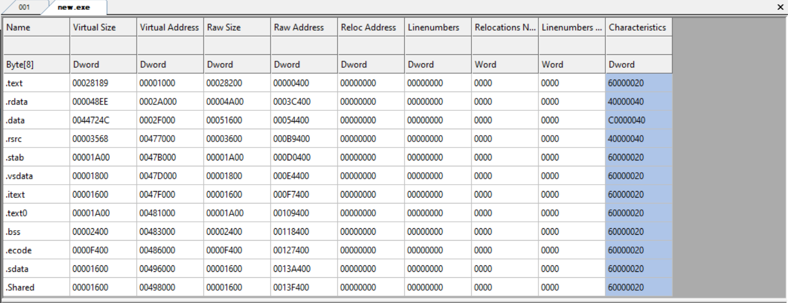

# MalWorkz
A Reinforcement Learning Engine for Bypassing Machine Learning Classifiers

>“Mistakes” is the word you’re too embarrassed to use. You ought not to be. You’re a product of a trillion of them. Evolution forged the entirety of sentient life on this planet using only one tool: the mistake.\
>\- *Robert Ford* 

## Overview
MalWorkz is a reinforcment learning engine that attempts to bypass machine learning classifers by manipulating a Portable Executable (PE) file through a set of 6 distinct methods.  Works with x32 PE/.NET/.dll files and with a variety of file formats such as UPX or MSI.  The 6 different obfuscation techniques utilized in this engine are 
1.  Header Randomization
2.  Code Cave Creation
3.  AddressOfEntryPoint Section Encryption
4.  Section Addition
5.  Section Renaming
6.  PE Signing

### Header Randomizatiom
There are a number of PE header's that can be randomly chosen which will not effect the behavior of the PE nor corrupt the image.  The headers which will be manipulated are 
1. `DllCharacteristics` (Optional Header)
2. `Characteristics` (File Header)
3. `Debug Directory RVA` (Zeroed Out)
4. `Debug Directory Size` (Zeroed Out)
5. `MajorImageVersion`
6. `MinorImageVersion`
7. `MajorOperatingSystemVersion`
8. `MinorOperatingSystemVersion`
9. `SizeOfStackReserve`
10. `SizeOfStackCommit`
11. `MajorLinkerVersion`
12. `MinorLinkerVersion`
13. `TimeDateStamp`

### Code Cave Creation
Code cave creation within a Windows Portable Executable (PE) is an interesting technique to bypass malware classifiers which utilize the entire byte sequence or raw bytes of a PE as their input feature.  Code caves are the "slack space" or byte space within a PE section that is unused by the program, but is created in order to adhere to the `SectionAlignment` header within the PE.  All PE sections must adhere to the byte alignment specified by this header value and if the section data does not directly align itself on this boundary the compiler will add null bytes as padding to ensure that the section is the specified size.

<br/>

Code caves can be created by modifying the `RawAddress` variable within the each section's header.  Arbitrary data can then be added in between each section which can then be used to "confuse" malware classifiers which attempt to use an entire binary's raw data as an input feature.  MalWorkz will create code caves in 512 byte increments and inject randomly chosen data from benign PE sections harvested from Windows SysWOW64 executables.  

<br/>
<p align="center">
  
  <p align="center"><i>Representation of the memory mapping of the original sample and a modified version with unused spaces introduced by the attacker (Yuste et al., 2022)</i></p>
</p>

### AddressOfEntryPoint Section Encryption
This technique XOR encrypts the main code section which is primarily the `.text` section of the PE.  The program will find the section which maps to the `AddressOfEntryPoint` XOR encrypt the section with a 1 byte key and either inject decrypting shellcode into the slack space of that section if there is enough free bytes or create a new section with the decryption shellcode data.  During runtime the shellcode will decrypt the main code section and upon its completion will jump back to the original entrypoint.  This technique is especially effective for .NET PE's whose import table and `.NET MetaData Directory` map to the main code section.  This effectively encrypts all imports and obfuscates them from malware classifers which attempt to utilize imports for feature extraction.  Imports are resolved at runtime and not when the .NET exe is loaded into memory unlike generic x32 PE's or dll's. 

<br/>
<p align="center">
  
  <p align="center"><i>Import Directory is Obfuscated</i></p>
</p>

<br/>
<p align="center">
  
  <p align="center"><i>Python LIEF Module Attempting to Read the Import Table</i></p>
</p>

### Section Addition
Random data sections can also be added to a PE file in another attempt to try and confuse machine learnine malware classifers.  Sections from legitimate Windows binaries were extracted and placed into the `data_sections` directory.  These sections are then used to try to create an "apperance" of a legitiamte Windows binary.  This technique is effective against classifiers that use N-Gram analysis as a feature. 

### Section Renaming
This technique merely uses a list of common PE section names and renames the section with a name from that list.  Common section names are `.ndata`, `.bss`, `edata`, `00cfg`, etc.

<br/>
<p align="center">
  
  <p align="center"><i>PE Before Adding Sections</i></p>
</p>

<br/>
<p align="center">
  
  <p align="center"><i>PE After Adding Sections</i></p>
</p>

### PE Signing
Digitally signing the PE with a self signed certificate was also incorporated into the engine dince some malware classifiers use a digital signture as a feature.  A certifcate is supplied `mycert.pfx` and is used in conjuction with the Windows tool `SignTool`. 

## How to Use
MalWorkz allows for the user to customize 7 different parameters to facilitate the generating of an adversarial PE.  

`malware_path`: Path to the malware executable which is to me modified.
</br>
</br>
`new_pe_name`: The name of the PE file which will be output.
</br>
</br>
`step`:  This is the minimal drop in the prediction score that the program will accept in order to keep the modification to the PE.
</br>
</br>
`threshold`: The minimal value that the prediction score must be for the program to finish.
</br>
</br>
`model`: The machine learning model to be used. MalWorkz out of the box comes with 3 different models `ember`, `malconv` and `nonneg_malconv`.
</br>
</br>
`max_epochs`: The max number of iterations that the program will run if the `threshold` is not met.
</br>
</br>
`action_set`: A list of actions that MalWorkz will incorporate while running.
</br>
</br>

To run simply execute the method `generate_adversarial_pe()`.

```python
from MalWorkz.MalWorkz import MalWorkz, ActionSet


def main():
    m = MalWorkz(
        malware_path="malware/malware.exe",
        new_pe_name="new.exe",
        step=0.000001,
        threshold=0.82,
        model="ember",
        max_epochs=10000,
        action_set=[
            ActionSet.RANDOMIZE_HEADERS,
            ActionSet.ADD_SECTION,
            ActionSet.ADD_CODE_CAVE,
            ActionSet.ADD_STUB_AND_ENCRYPT_CODE,
            ActionSet.RENAME_EXISTING_SECTION,
            ActionSet.SIGN_PE,
        ],
    )
    m.generate_adversarial_pe()


if __name__ == "__main__":
    main()
```

## Setup
Python version `3.6` <b>MUST</b> be used.  

Install the `requirements.txt` file in a python virtual environment.
```bash
pip install -r requirements.txt
```
Unzip `models.zip`

Install Windows [SignTool](https://docs.microsoft.com/en-us/windows/win32/seccrypto/signtool).  This tool is used for signing PE files.  The MalWorkz engine will use `SignTool` in conjuction with a supplied `.pfx` file.  After `SignTool` is installed add the location to Windows system environment varibles so that the program may call it.  

## References
Ember, MalConv and Nonneg Malconv Classes and Model's were taken from the repo - [Malware Evasion Competition](https://github.com/endgameinc/malware_evasion_competition)
</br>
Ember White Paper - [EMBER: An Open Dataset for Training Static PE Malware
Machine Learning Models](https://arxiv.org/pdf/1804.04637.pdf)
</br>
MalConv White Paper - [Malware Detection by Eating a Whole EXE](https://arxiv.org/pdf/1710.09435.pdf)
</br>
Nonneg Malconv White Paper - [Non-Negative Networks Against Adversarial Attacks](https://arxiv.org/pdf/1806.06108.pdf)
</br>
Code Cave White Paper - [Optimization of code caves in malware binaries to evade machine learning detectors](https://www.sciencedirect.com/science/article/pii/S0167404822000426)
</br>
RootedCon 2020 Code Cave Talk - [Evading Deep Learning Malware Detectors](https://www.youtube.com/watch?v=Qp4hx6HTHrQ)
